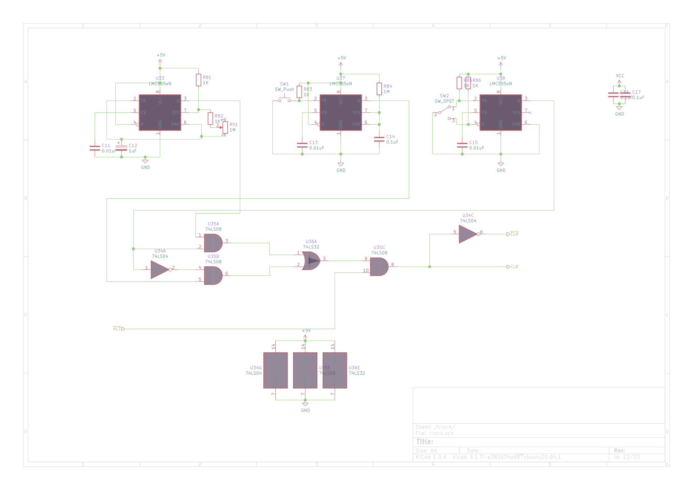
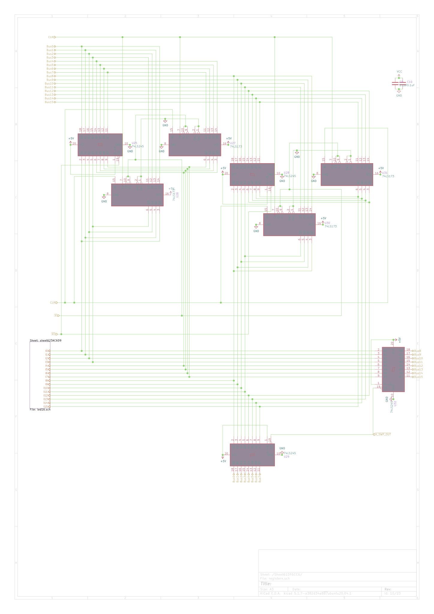

A 16 Bit CPU Schematic

## Instruction Set

It can be found [here](https://docs.google.com/spreadsheets/d/1bDObkBc0xerhLb_7aUqUZHJFpincPKz191_meNZrJVs/edit?usp=sharing)

The cpu has 2 Resgisters , an Instruction Register,A Memory Access Register and a simple adder/subtractor and 8Kb RAM and ROM 

*Overview*

*Clock*

*Register*

*Swap-Register*

*ALU*

*Program Counter*

*RAM*

*Control Unit*

*Instruction Register*

*LEDs*

*Display*

*Power*
